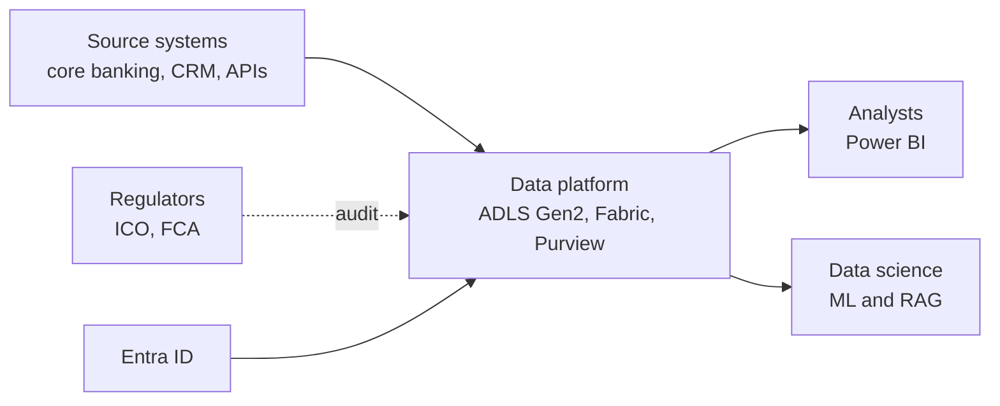

# C4 Level 1: System Context

```mermaid
flowchart LR
  src["Source systems<br/>core banking, CRM, APIs"] --> plat["Data platform<br/>ADLS Gen2, Fabric, Purview"]
  plat --> bi["Analysts<br/>Power BI"]
  plat --> ds["Data science<br/>ML and RAG"]
  reg["Regulators<br/>ICO, FCA"] -. audit .-> plat
  ent["Entra ID"] --> plat
```

Status: draft. The fictional UK client is defined on Day 3.
